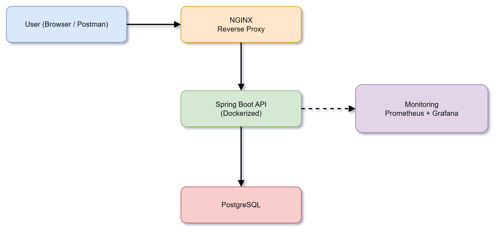
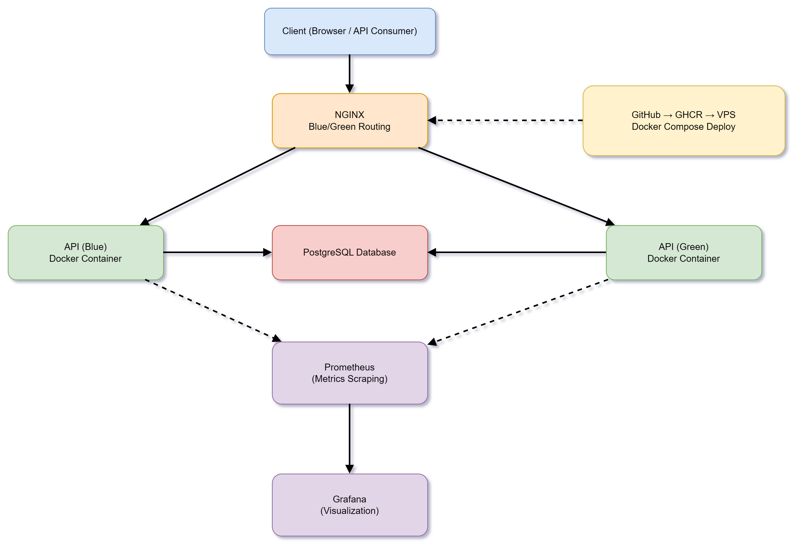

# 🚀 Contact API — Production-Ready Spring Boot Backend

A **production-grade backend system** built with Spring Boot, containerised using Docker, and deployed on a VPS with **zero-downtime blue-green deployment**, **NGINX reverse proxy**, and **full monitoring using Prometheus & Grafana**.

---

## 🏗️ Architecture Overview

<p align="center">
  
</p>

---

## ⚙️ Detailed System Architecture

<p align="center">
  
</p>

---

## 🚀 Key Features

* 🔁 **Blue-Green Deployment** (Zero Downtime)
* 🐳 **Dockerized Application**
* 🌐 **NGINX Reverse Proxy Routing**
* 📊 **Monitoring with Prometheus & Grafana**
* 🛢️ **PostgreSQL Database Integration**
* ⚙️ **CI/CD via GitHub + GHCR**
* 🔐 **Environment-based Configuration (.env)**
* 📈 **Production Observability Setup**

---

## 🧱 Tech Stack

| Layer      | Technology           |
| ---------- | -------------------- |
| Backend    | Spring Boot          |
| Database   | PostgreSQL           |
| Container  | Docker               |
| Proxy      | NGINX                |
| Monitoring | Prometheus, Grafana  |
| CI/CD      | GitHub Actions, GHCR |
| Deployment | VPS (Linux)          |

---

## 🔁 Deployment Strategy (Blue-Green)

This project implements a **blue-green deployment strategy** to ensure zero downtime.

### Flow:

1. New version is deployed to **inactive environment** (Green)
2. Health checks are verified
3. NGINX switches traffic:

   ```
   Blue → Green
   ```
4. Old version remains as a fallback

### Result:

* ✅ Zero downtime
* ✅ Instant rollback capability
* ✅ Safe production deployments

---

## 📊 Monitoring & Observability

* **Prometheus** scrapes metrics from:

  ```
  /actuator/prometheus
  ```
* **Grafana** visualizes:

  * CPU usage
  * Memory usage
  * Request metrics
  * Container health

---

## 🐳 Docker Setup

### Run with Docker Compose

```bash
docker-compose up -d
```

### Services:

* contact-api (blue/green)
* postgres
* prometheus
* grafana
* nginx

---

## 🌐 API Endpoints

| Method | Endpoint       | Description       |
| ------ | -------------- | ----------------- |
| GET    | /contacts      | Get all contacts  |
| POST   | /contacts      | Create contact    |
| GET    | /contacts/{id} | Get contact by ID |
| PUT    | /contacts/{id} | Update contact    |
| DELETE | /contacts/{id} | Delete contact    |

---

## 🧪 Run Locally

```bash
git clone https://github.com/vimal-java-dev/vimaltech-contact-api
cd vimaltech-contact-api

docker-compose up --build
```

---

## ☁️ Production Deployment

### Steps:

1. Push Docker image to GHCR
2. Pull the image on the VPS
3. Run `deploy.sh`
4. Switch NGINX between blue/green

---

## 🔐 Security Considerations

* Environment variables via `.env`
* NGINX as reverse proxy (no direct exposure)
* Container isolation
* Controlled port exposure

---

## 📸 Screenshots (Add Here)

> Add:

* Grafana dashboard
* Prometheus targets
* Docker containers
* Blue-Green switch logs

---

## 🎯 What This Project Demonstrates

* Real-world backend system design
* DevOps integration with backend development
* Zero-downtime deployment strategy
* Monitoring & observability setup
* Production-ready architecture thinking

---

## 🌍 Live Demo

👉 https://vimaltech.dev/

---

## 👨‍💻 Author

**Vimal Patel**

Backend Developer | Spring Boot | DevOps Enthusiast

---
